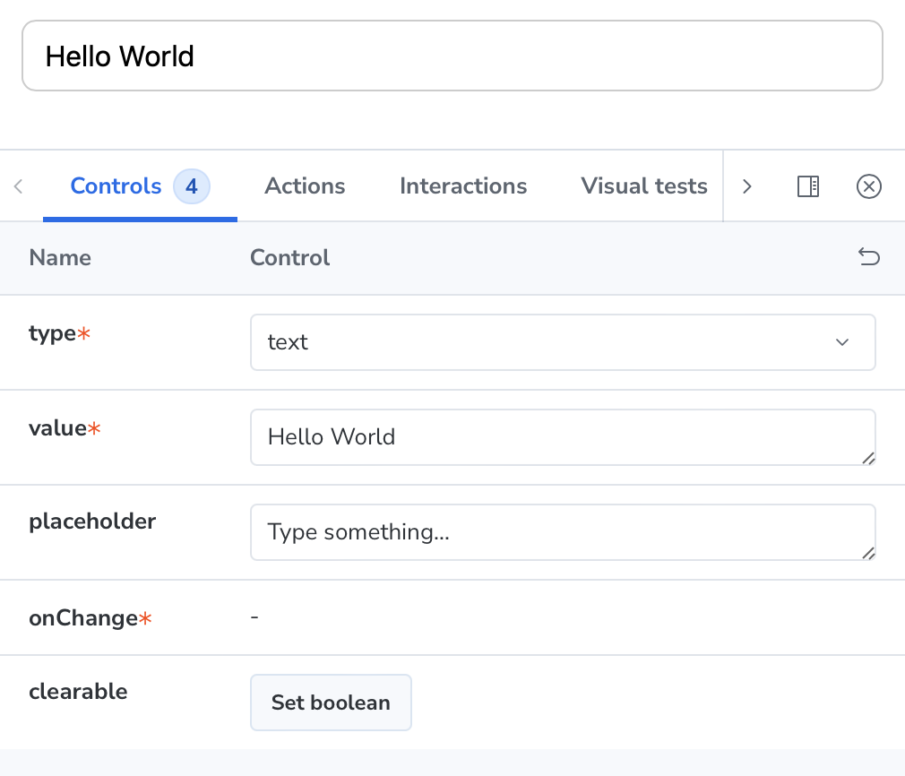
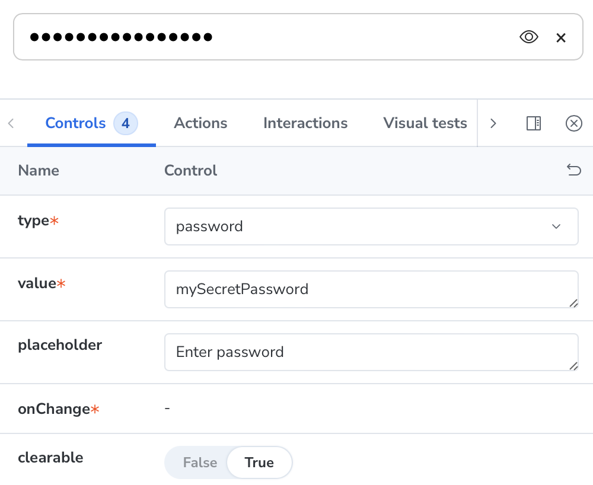
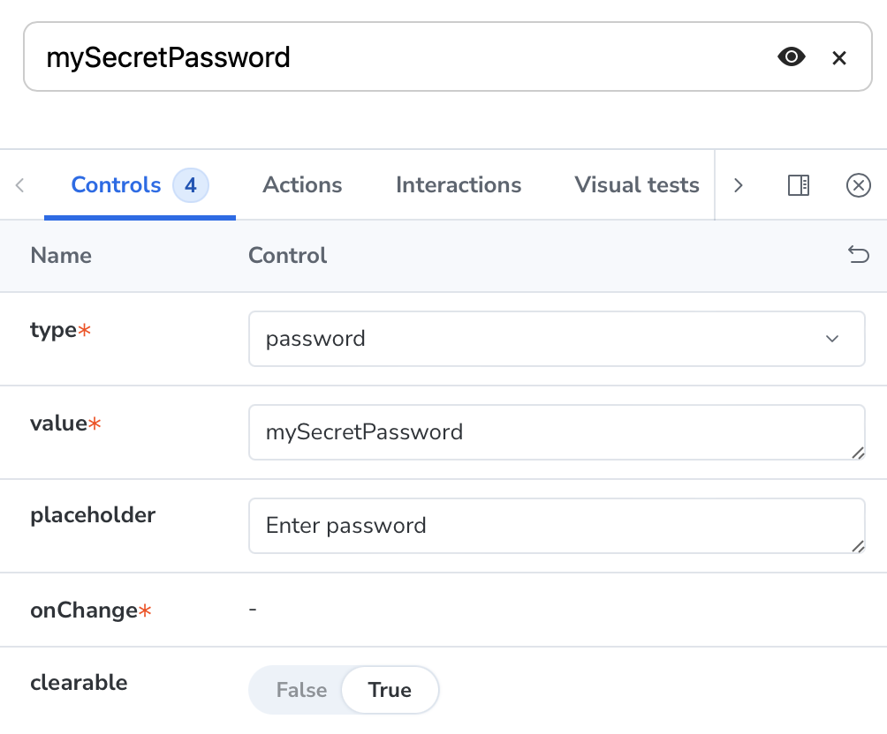
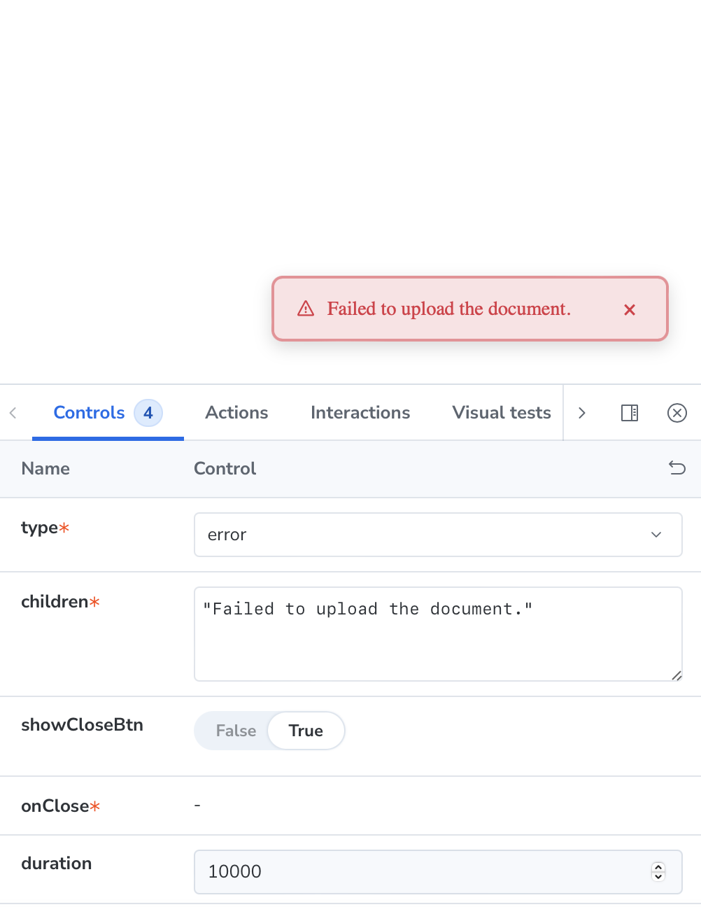
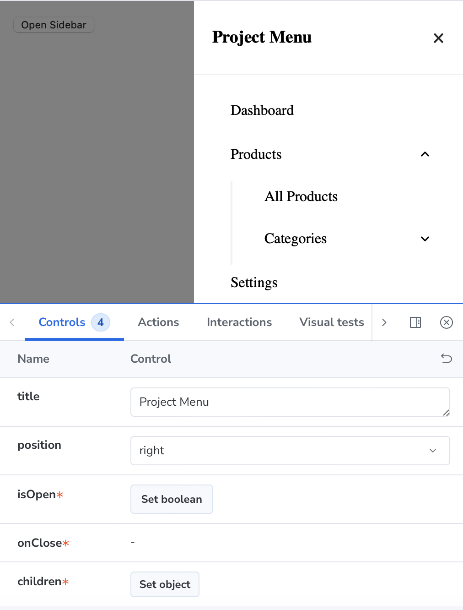
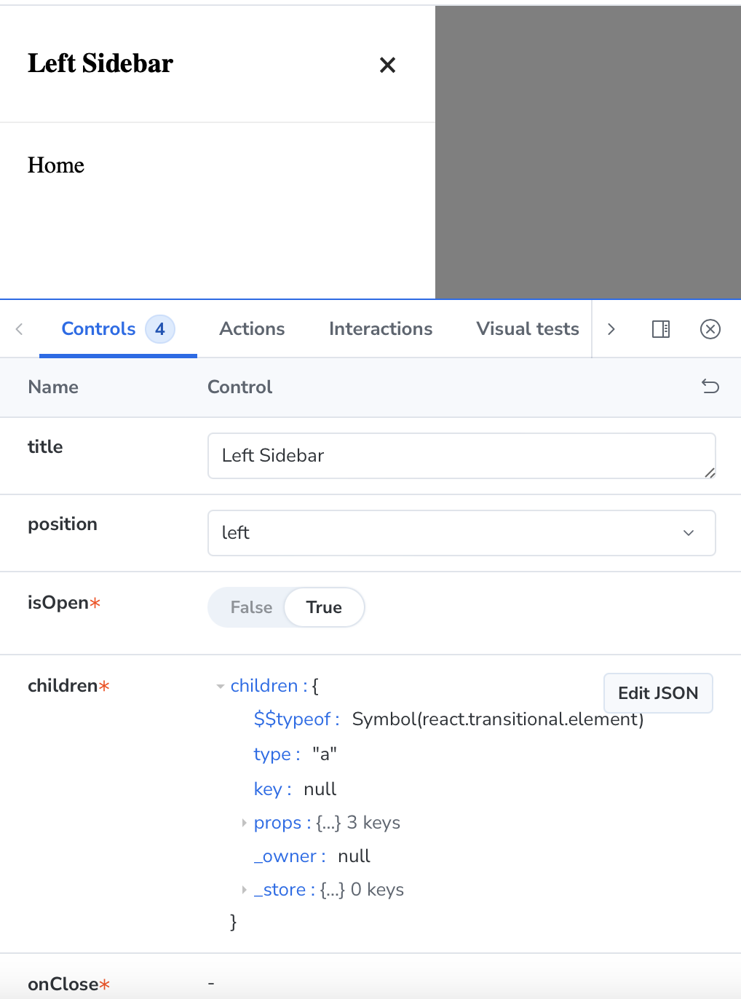

# Custom UI Component Library

A reusable React component library built with **TypeScript**, **Vite**, and **Storybook**. This library focuses on interactive elements with smooth transitions and modular styles using CSS Modules.

## Installation & Setup

### 1) Clone the repository

```bash
git clone https://github.com/e1em9nt/ui-component-library.git
cd ui-component-library
```

### 2) Install dependencies

```bash
npm install
```

### 3) Run Storybook

```bash
npm run storybook
```

## Components

### 1) Input Component

Input field with support for multiple types and interactive features.

**Variants:** Text, Password, Email

### 2) Toast Component

A notification system in the bottom-right corner with auto-dismiss behavior.

**States / Options:**

- **Variants:** Success, Warning, Error
- **Durations:** configurable display time
- **Manual Close:** optional close button
- **Transitions:** slides in from the right and fades out on close

### 3) Sidebar Menu Component

A slide-in navigation menu with support for nested items.

**Behavior:**

- Slides in from the right side of the screen
- Automatically closes when clicking on the backdrop (overlay)

## Screenshots

### Storybook Overview


### Input Component

| Input Default                                         | Password Hidden Clearable                                         | Password Visible Clearable                                       |
| ----------------------------------------------------- | ----------------------------------------------------------------- | ---------------------------------------------------------------- |
|  |  |  |

### Toast Component

| Success State                                            | Error State                                          |
| -------------------------------------------------------- | ---------------------------------------------------- |
|  |  |

### Sidebar Menu

| Closed State                                                   | Open (Nested) State                                      |
| -------------------------------------------------------------- | -------------------------------------------------------- |
|  |  |

## Project Structure

- `src/components/` — component logic and styles
- `src/icons/` — reusable SVG icons
- `src/index.ts` — main entry point for library exports
